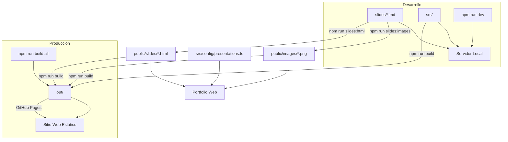

# Portfolio Personal con Presentaciones Marp

Un portfolio personal moderno construido con Next.js que incluye un sistema integrado de presentaciones usando Marp (Markdown Presentation Ecosystem).

## 🚀 Características

- **Portfolio responsivo** con diseño moderno
- **Sistema de presentaciones Marp** integrado
- **Exportación estática** compatible con GitHub Pages
- **Filtros inteligentes** para artículos y presentaciones
- **Temas personalizados** para presentaciones
- **Generación automática** de HTML desde Markdown

## 📋 Requisitos

- Node.js 18+
- npm o yarn
- PowerShell (para scripts de automatización)

## 🛠️ Instalación

```bash
# Clonar el repositorio
git clone https://github.com/TuUsuario/tu-portfolio.git
cd tu-portfolio

# Instalar dependencias
npm install

# Ejecutar en modo desarrollo
npm run dev
```

## 🎯 Sistema de Presentaciones Marp

### ¿Qué es Marp?

Marp (Markdown Presentation Ecosystem) permite crear presentaciones profesionales usando Markdown. Este portfolio integra Marp para mostrar presentaciones junto con artículos de blog.

### 📁 Estructura de Archivos

```
slides/
├── README.md                    # Documentación de slides
├── devops-introduction.md       # Presentación de ejemplo
├── kubernetes-basics.md         # Otra presentación
├── themes/
│   └── base.css                # Tema personalizado
└── output/                     # Archivos temporales

public/
├── slides/                     # HTML generado
│   ├── devops-introduction.html
│   └── kubernetes-basics.html
└── images/                     # Imágenes de presentaciones
    ├── devops-presentation.svg
    └── kubernetes-basics-presentation.svg

src/config/
└── presentations.ts            # Configuración centralizada
```

### 🆕 Crear una Nueva Presentación

#### Método 1: Script Automatizado (Recomendado)

```powershell
# Crear una nueva presentación
.\new-presentation.ps1 -Name "mi-presentacion" -Title "Mi Título" -Author "Tu Nombre"
```

Esto creará:
- `slides/mi-presentacion.md` con plantilla base
- `public/slides/mi-presentacion.html` generado automáticamente
- Registro en la configuración

#### Método 2: Manual

1. **Crear archivo Markdown:**
```markdown
---
marp: true
theme: base
paginate: true
header: 'Mi Presentación'
footer: 'Tu Nombre | Fecha'
---

# Mi Presentación

## Slide de introducción

---

## Contenido

- Punto 1
- Punto 2
- Punto 3

---

## Conclusión

¡Gracias por su atención!
```

2. **Generar HTML:**
```powershell
.\build-slides.ps1
```

3. **Registrar en configuración:**
Editar `src/config/presentations.ts` y agregar:
```typescript
{
  id: 'mi-presentacion',
  title: 'Mi Título',
  category: 'TECHNOLOGY',
  description: 'Descripción de la presentación',
  tags: ['tag1', 'tag2'],
  date: '2024-01-15'
}
```

### 🎨 Personalizar Temas

Edita `slides/themes/base.css` para personalizar el diseño:

```css
/* Ejemplo de personalización */
section {
  background: linear-gradient(135deg, #667eea 0%, #764ba2 100%);
  color: white;
}

h1 {
  color: #ffd700;
  text-shadow: 2px 2px 4px rgba(0,0,0,0.5);
}
```

### 🖼️ Imágenes de Presentación

Las imágenes de presentación se generan automáticamente en formato PNG:

1. **Generación automática:**
```bash
npm run slides:images    # Genera imágenes PNG de todas las presentaciones
```

2. **Ubicación de archivos:**
```
public/images/
├── README.png                    # Imagen de README.md
├── devops-introduction.png       # Imagen de devops-introduction.md
└── kubernetes-basics.png         # Imagen de kubernetes-basics.md
```

3. **Referencia en configuración:**
```typescript
// En src/config/presentations.ts
// Las imágenes se referencian automáticamente como:
// `/images/${id}.png`
```

4. **Personalización:**
Para personalizar las imágenes, modifica el contenido y diseño de tus presentaciones Markdown. Las imágenes se generan basándose en la primera diapositiva de cada presentación.

## 🌐 Despliegue en GitHub Pages

### ¿Cómo Funciona en Páginas Estáticas?

Este sistema está diseñado específicamente para funcionar en GitHub Pages:

1. **Pre-generación:** Las presentaciones se convierten de Markdown a HTML durante el build
2. **Archivos estáticos:** Todo se exporta como HTML, CSS y JS estáticos
3. **Sin servidor:** No requiere procesamiento del lado del servidor
4. **Workflow automatizado:** GitHub Actions maneja todo el proceso

### 🔄 Proceso de Despliegue

Cuando haces push a la rama `main`:

1. **GitHub Actions se ejecuta:**
   ```yaml
   - name: Install Marp CLI
     run: npm install -g @marp-team/marp-cli
   
   - name: Generate Marp presentations
     run: |
       mkdir -p public/slides
       for file in slides/*.md; do
         filename=$(basename "$file" .md)
         marp --theme-set slides/themes --html --allow-local-files --output "public/slides/$filename.html" "$file"
       done
   ```

2. **Next.js exporta archivos estáticos:**
   ```bash
   npm run build  # Genera directorio 'out/'
   ```

3. **Se despliega en GitHub Pages:**
   - Aplicación principal: `https://tudominio.github.io/`
   - Presentaciones: `https://tudominio.github.io/slides/nombre-presentacion.html`

### ⚙️ Configuración Necesaria

El proyecto incluye configuración optimizada para GitHub Pages:

**next.config.js:**
```javascript
module.exports = {
  output: 'export',        // Exportación estática
  trailingSlash: true,     // URLs compatibles
  images: {
    unoptimized: true      // Imágenes sin optimización del servidor
  }
}
```

**Archivo .nojekyll:**
Incluido para evitar procesamiento Jekyll de GitHub.

## 🎛️ Comandos Disponibles

### Comandos de Desarrollo
```bash
npm run dev              # Servidor de desarrollo Next.js
npm run build            # Build completo de Next.js para producción
npm run start            # Servidor de producción Next.js
npm run lint             # Linter de código
```

### Comandos de Presentaciones
```bash
# Comandos individuales
npm run slides:html      # Generar archivos HTML de presentaciones (usa npx marp)
npm run slides:images    # Generar imágenes PNG de presentaciones (usa npx marp)
npm run slides:assets    # Copiar assets (images/, themes/, whiteboard.js) a public/
npm run slides:serve     # Servidor de desarrollo para presentaciones (usa npx marp)
npm run slides:clean     # Limpiar archivos generados
npm run slides:list      # Listar archivos generados

# Comandos combinados
npm run slides:build     # Generar HTML + imágenes + assets (slides:html + slides:images + slides:assets)
npm run build:all        # Build completo (slides:build + build)
```

**📋 Nota:** Los scripts ahora usan `npx marp` y son **multiplataforma** (Windows/Linux/macOS), compatibles con GitHub Actions.

### 🪟 Desarrollo en Windows

Para desarrollo en Windows, puedes usar tanto los comandos npm como el script de PowerShell incluido:

#### Opción 1: Comandos npm (Recomendado)
```bash
npm install              # Instalar dependencias (incluye @marp-team/marp-cli)
npm run slides:build     # Generar presentaciones
npm run dev              # Servidor de desarrollo
```

#### Opción 2: Script PowerShell
```powershell
# Instalar dependencias primero
npm install

# Usar script PowerShell
.\build-slides.ps1                    # Generar todas las presentaciones
.\build-slides.ps1 -Action all        # Generar todas las presentaciones
.\build-slides.ps1 -Action assets     # Copiar solo assets (imágenes, temas)
.\build-slides.ps1 -Action clean      # Limpiar archivos generados
.\build-slides.ps1 -Action help       # Mostrar ayuda
.\build-slides.ps1 -Action single -File nombre.md # Generar una presentación específica

# Script para crear nuevas presentaciones
.\new-presentation.ps1   # Crear nueva presentación interactivamente
```

**Características del script PowerShell:**
- ✅ Usa `npx marp` (no requiere instalación global)
- ✅ Copia automáticamente assets (imágenes, temas, whiteboard.js)
- ✅ Crea directorios necesarios automáticamente
- ✅ Manejo de errores y mensajes informativos
- ✅ Equivalente a los comandos npm pero con interfaz PowerShell nativa

### Flujo de Trabajo Recomendado

1. **Desarrollo local:**
   ```bash
   npm run dev              # Inicia servidor de desarrollo
   ```

2. **Crear nueva presentación:**
   ```bash
   # Crear archivo .md en slides/
   npm run slides:build     # Generar HTML e imágenes
   ```

3. **Build para producción:**
   ```bash
   npm run build:all        # Build completo con presentaciones
   ```

## 📚 Estructura del Proyecto

### Diagrama de Arquitectura



### Estructura de Directorios

```
📁 Portfolio con Presentaciones Marp
├── 📁 .github/workflows/     # GitHub Actions para CI/CD
├── 📁 public/               # Archivos estáticos públicos
│   ├── 📁 slides/          # 🔄 Presentaciones HTML generadas
│   ├── 📁 images/          # 🔄 Imágenes PNG de presentaciones
│   ├── favicon.ico
│   ├── curved-lines.svg
│   └── dots-pattern.svg
├── 📁 slides/              # 📝 Fuentes Markdown de presentaciones
│   ├── 📁 themes/         # Temas CSS personalizados
│   │   └── base.css
│   ├── 📁 output/         # 🔄 Archivos temporales
│   ├── README.md
│   ├── devops-introduction.md
│   └── kubernetes-basics.md
├── 📁 src/                 # Código fuente de la aplicación
│   ├── 📁 components/     # Componentes React reutilizables
│   ├── 📁 config/         # Configuración de presentaciones
│   │   └── presentations.ts
│   ├── 📁 pages/          # Páginas Next.js
│   ├── 📁 styles/         # Estilos globales
│   └── 📁 utils/          # Utilidades
├── 📁 out/                # 🔄 Build estático para GitHub Pages
│   ├── 📁 slides/         # HTML copiado
│   ├── 📁 images/         # Imágenes copiadas
│   └── index.html         # Página principal
├── 📄 package.json        # Dependencias y scripts npm
├── 📄 next.config.js      # Configuración Next.js
├── 📄 Makefile           # Comandos Make alternativos
├── 🔧 build-slides.ps1   # Script PowerShell de generación
├── 🔧 new-presentation.ps1 # Script PowerShell de creación
└── 📄 .gitignore         # Archivos ignorados por Git

🔄 = Archivos generados automáticamente
📝 = Archivos editables por el usuario
📁 = Directorios
📄 = Archivos de configuración
🔧 = Scripts de automatización
```

## 📦 Gestión de Archivos y Git

### ¿Qué se sube al repositorio?

**✅ Archivos que SÍ se deben subir:**
- `slides/*.md` - Archivos fuente de presentaciones
- `slides/themes/` - Temas CSS personalizados
- `src/` - Código fuente de la aplicación
- `package.json` - Dependencias y scripts
- `next.config.js` - Configuración de Next.js
- `README.md` - Documentación
- Scripts PowerShell (`.ps1`)
- `Makefile`

**❌ Archivos que NO se deben subir (auto-generados):**
- `public/slides/*.html` - Generados por `npm run slides:html`
- `public/images/*.png` - Generados por `npm run slides:images`
- `public/slides/images/` - Copiados por `npm run slides:assets`
- `public/slides/themes/` - Copiados por `npm run slides:assets`
- `public/slides/whiteboard.js` - Copiado por `npm run slides:assets`
- `out/` - Build de Next.js generado por `npm run build`
- `slides/output/` - Archivos temporales de Marp
- `node_modules/` - Dependencias instaladas
- `.next/` - Cache de Next.js

### Flujo de Git

```bash
# 1. Crear/editar presentación
vim slides/mi-nueva-presentacion.md

# 2. Actualizar configuración si es necesario
vim src/config/presentations.ts

# 3. Subir solo archivos fuente
git add slides/mi-nueva-presentacion.md
git add src/config/presentations.ts
git commit -m "Add: nueva presentación sobre..."
git push

# 4. GitHub Actions se encarga del resto automáticamente
```

### ¿Por qué esta estructura?

- **Repositorio limpio:** Solo código fuente, no archivos generados
- **CI/CD automático:** GitHub Actions genera todo en el despliegue
- **Colaboración fácil:** Los colaboradores solo editan archivos fuente
- **Versionado eficiente:** Git solo rastrea cambios importantes

## 🔧 Solución de Problemas

### Errores 404 en Assets de Presentaciones

**Problema:** Errores como `GET /slides/images/vscode-marp.png 404` o `GET /slides/themes/back-starline.jpg 404`

**Causa:** Next.js solo sirve archivos estáticos desde `public/`, pero los assets están en `slides/images/` y `slides/themes/`

**Solución:**
```bash
# Copiar assets automáticamente (multiplataforma)
npm run slides:assets

# O manualmente en Windows:
xcopy "slides\images\*" "public\slides\images\" /E /I /Y
xcopy "slides\themes\*" "public\slides\themes\" /E /I /Y
copy "slides\whiteboard.js" "public\slides\whiteboard.js"

# O manualmente en Linux/macOS:
mkdir -p public/slides/images public/slides/themes
cp -r slides/images/* public/slides/images/
cp -r slides/themes/* public/slides/themes/
cp slides/whiteboard.js public/slides/
```

**Estructura resultante:**
```
public/slides/
├── *.html              # Presentaciones generadas
├── images/             # 🔄 Copiado desde slides/images/
│   ├── presentacion.png
│   ├── vscode-marp.png
│   └── vscode-revealjs.png
├── themes/             # 🔄 Copiado desde slides/themes/
│   ├── *.css
│   ├── *.jpg
│   └── subdirectorios/
└── whiteboard.js       # 🔄 Copiado desde slides/
```

### Presentación no aparece en la web
1. Verificar que el archivo `.md` esté en `slides/`
2. Ejecutar `npm run slides:build`
3. Verificar configuración en `presentations.ts`
4. Hacer rebuild: `npm run build:all`

### Error en GitHub Actions
1. Verificar sintaxis Markdown de las presentaciones
2. Comprobar que no hay caracteres especiales en nombres de archivo
3. Revisar logs en la pestaña Actions de GitHub

### Tema no se aplica
1. Verificar que `slides/themes/base.css` existe
2. Comprobar que el frontmatter incluye `theme: base`
3. Ejecutar `npm run slides:assets` para copiar temas
4. Regenerar presentaciones con `npm run slides:build`

## 🤝 Contribuir

1. Fork el proyecto
2. Crear rama feature (`git checkout -b feature/nueva-funcionalidad`)
3. Commit cambios (`git commit -am 'Agregar nueva funcionalidad'`)
4. Push a la rama (`git push origin feature/nueva-funcionalidad`)
5. Crear Pull Request

## 📄 Licencia

Este proyecto está bajo la Licencia MIT. Ver `LICENSE` para más detalles.

## 🙏 Agradecimientos

- [Marp](https://marp.app/) - Sistema de presentaciones Markdown
- [Next.js](https://nextjs.org/) - Framework React
- [Tailwind CSS](https://tailwindcss.com/) - Framework CSS
- [GitHub Pages](https://pages.github.com/) - Hosting gratuito