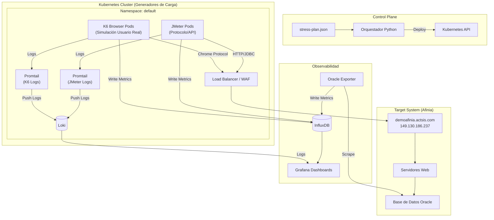

# AFINIA — Día 4: Configuración de Monitoreo
## Infraestructura de Pruebas de Estrés

<!-- _class: first-slide -->

<!--
Objetivos: visibilidad end-to-end, validación de métricas, aprobación del monitoreo.
Alcance: App web, base de datos Oracle 19c, inyectores JMeter/K6, infraestructura.
Alinear métricas con criterios de aceptación del Comité Evaluador.
-->

<!--
Buenos días a todos. Hoy nos centraremos en el cuarto día de nuestra agenda: la Configuración de Monitoreo.
Nuestro objetivo principal es asegurar una visibilidad completa de extremo a extremo, desde la aplicación web hasta la base de datos Oracle.
Validaremos que las métricas se capturen correctamente y buscaremos su aprobación para que el monitoreo sea el insumo oficial de evaluación.
-->

---

# Agenda día 4

<!-- _class: cool-list toc -->

1. [Definir métricas a observar (rendimiento, recursos, errores)](#3)
1. [Confirmar herramientas de monitoreo/APM disponibles](#3)
1. [Acordar visibilidad de dashboards para el equipo evaluador](#3)
1. [Configurar monitoreo de aplicación, base de datos e infraestructura](#4)
1. [Habilitar dashboards y alertas](#8)
1. [Validar que las métricas se capturan correctamente](#10)
1. [Confirmar que el monitoreo queda activo y estable](#10)
1. [Congelar configuración para evitar ajustes durante las pruebas](#10)

<!--
Esta es la agenda detallada para hoy.
Comenzaremos definiendo qué métricas son críticas para nosotros.
Luego, confirmaremos que nuestras herramientas (APM, dashboards) están listas y disponibles.
Un punto clave es acordar qué verán los evaluadores en tiempo real.
Procederemos a configurar y habilitar todo el stack de monitoreo.
Finalmente, validaremos la captura de datos y congelaremos la configuración para garantizar estabilidad durante las pruebas de estrés.
-->

---

<!-- _class: split-columns inverted -->

# Herramientas

## Stack de Observabilidad

- **InfluxDB**: Almacenamiento de métricas.
- **Grafana**: Visualización y Dashboards.
- **Loki**: Centralización de logs.
- **Oracle Exporter**: Métricas de Base de Datos.

# Métricas Clave

## Visibilidad

- **Rendimiento**: Latencia, Throughput (TPS).
- **Recursos**: CPU, Memoria, IOPS.
- **Errores**: Tasas de error HTTP/DB, bloqueos.

Dashboards visibles para el equipo evaluador

<!--
En esta diapositiva contrastamos nuestras herramientas con lo que necesitamos ver.
A la izquierda, nuestro stack técnico ya desplegado: InfluxDB para series de tiempo, Grafana para visualización, Loki para logs y el exportador específico de Oracle.
A la derecha, lo que realmente importa al negocio y a la evaluación: Rendimiento (latencia y RPS), uso de recursos y tasas de error.
El objetivo es que la tecnología de la izquierda nos entregue la visibilidad de la derecha.
-->

---

# Topología de la Infraestructura

- **Arquitectura**: Distribuida sobre Kubernetes.
- **Componentes**: Orquestador (Python), Jobs (JMeter/K6), InfluxDB, Grafana.
- **Target**: `demoafinia.actsis.com` (149.130.186.237).

---

# Diagrama de Arquitectura

<!--
Aquí vemos la topología completa.
El orquestador en Python despliega los trabajos en Kubernetes.
Tenemos dos tipos de generadores de carga: JMeter para protocolo y K6 para navegador, ambos atacando al balanceador de carga de Afinia.
Lo más importante para hoy es la parte inferior: el subsistema de Observabilidad.
Noten cómo todos los componentes reportan a InfluxDB y Loki, centralizando la verdad en Grafana.
Además, el Oracle Exporter nos da una visión profunda de la base de datos, complementando las métricas de aplicación.
Esta arquitectura nos permite correlacionar la carga inyectada (arriba) con el impacto en el sistema (abajo).
-->

---

# Orquestación y Plan de Prueba

- **Archivo**: `stress-plan.json` define fases (inicio, calentamiento, ramp-up).
- **Escalado**: Progresivo según el plan de prueba.
- **Datos**: Distribución por índice (`CLIENTE_ID`).

La distribución de los usuarios/clientes en tus pruebas de K6 se realiza mediante una **lógica de asignación cíclica (Round Robin)** basada en el ID del usuario virtual (VU).

| Archivo JSON | Cantidad de Datos | Script que lo usa |
| :--- | :--- | :--- |
| **`Estrato_0_1634.json`** | **1,634** clientes | **`proOrden.js`** |
| **`Estrato_4_1130.json`** | **1,130** clientes | **`updUsu.js`** |

<!--
El plan de pruebas no es improvisado; está definido en un JSON estricto.
La lógica de distribución de datos es fundamental: usamos Round Robin basado en el ID del VU.
Esto garantiza que cada hilo virtual tenga un cliente único asignado.
Por ejemplo, si lanzamos 10 VUs, cada uno tomará un cliente distinto del archivo JSON cargado en memoria compartida.
Si escalamos más allá de la cantidad de datos (ej. más de 1634 VUs para estrato 0), la asignación dará la vuelta de forma segura.
-->

---

# Generadores de Carga: Recursos por Pod

| Tipo | Herramienta | Solicitud (Requests) | Límite (Limits) |
| :--- | :--- | :--- | :--- |
| **Estándar JMeter** | JMeter | **CPU:** 0.5 vCPU **RAM:** 1 GiB | **CPU:** 0.66 vCPU **RAM:** 4 GiB |
| **Estándar K6** | K6 | **CPU:** 0.5 vCPU **RAM:** 1 GiB | **CPU:** 2 vCPU **RAM:** 4 GiB |
| **proOrden** | K6 | **CPU:** 0.5 vCPU **RAM:** 1 GiB | **CPU:** 2 vCPU **RAM:** 4 GiB |
| **liqCiclo9** | JMeter | **CPU:** 0.25 vCPU **RAM:** 512 MiB | **CPU:** 0.5 vCPU **RAM:** 1 GiB |

<!--
Esta tabla resume la asignación de recursos en Kubernetes definida en el stress-plan.json.
Es crucial entender la diferencia entre Request y Limit:
Request es lo que el cluster garantiza para iniciar el pod.
Limit es el techo máximo; si un pod de JMeter intenta usar más de 4GB de RAM, será reiniciado (OOMKilled) para proteger el nodo.
Hemos dimensionado K6 con más CPU (hasta 2 vCPU) porque la simulación de navegador es intensiva en procesamiento.
-->

---

# Observabilidad: InfluxDB y Grafana

- **InfluxDB v2**: Org `AFINIA`, Bucket nombrado según la prueba (ej. `updUsu`, `proOrden`, etc.).  
- **Grafana**: Dashboards de VUs, latencia, error rate, recursos.
- **Acceso**: Organización y usuario creados para AFINIA (acceso en vivo).

<!-- TODO: Insertar captura aquí: Dashboard principal y variables en Grafana -->

<!--
Nuestra ventana a la realidad es Grafana.
Hemos configurado InfluxDB v2 como backend.
Hemos creado usuarios específicos para que el equipo de AFINIA pueda entrar y ver los tableros en tiempo real durante la prueba.
No hay cajas negras aquí.
-->

---

# Logs Distribuidos y Base de Datos

- **Logs**: Promtail + Loki para centralizar logs de JMeter, K6 y DB.
- **Base de Datos**: Oracle Database 19c Enterprise Edition.
- **Oracle Exporter**:
  - `v$session`, `v$sysmetric`
  - `wait_class`, bloqueos TX
  - Definido en `custom-metrics.toml`

<!-- TODO: Insertar captura aquí: Loki (filtros por job/pod) y panel de Oracle en Grafana -->

<!--
Para análisis de causa raíz, necesitamos logs y métricas profundas de base de datos.
Loki nos permite filtrar logs por pod o trabajo específico.
Y el Oracle Exporter está tuneado para extraer métricas vitales como sesiones activas, métricas del sistema y clases de espera, cruciales para detectar bloqueos en la base de datos.
-->

---

# Configuración y Estabilidad

<!-- _class: lead -->

---

<!-- _class: split-columns inverted -->

# Validación de Captura

- **Métricas**: Verificación de flujo InfluxDB -> Grafana.
- **Logs**: Verificación de flujo Promtail -> Loki.
- **Alertas**: Umbrales configurados para latencia y errores.

## Congelamiento

- **Configuración**: Se congela la configuración para evitar ajustes durante las pruebas.
- **Monitoreo**: Activo y estable.
- **Aprobación**: Insumo válido para evaluación.

Q: ¿Qué pasa si necesitamos cambiar la configuración de monitoreo durante la prueba?

<!--
Antes de proceder, validamos que los datos fluyan correctamente de extremo a extremo.
Una vez validado, entramos en estado de "Congelamiento".
Esto significa que no moveremos más configuraciones de monitoreo durante la prueba para asegurar que los datos sean consistentes y comparables.
-->

---

# Entregables y Evidencias

<!-- _class: lead -->

<!--
Finalmente, revisemos qué entregamos hoy y qué evidencias dejamos.
-->

---

# Validación de Visibilidad

1. **Dashboards configurados**: Paneles operativos y accesibles.
2. **Evidencia de métricas visibles**: Capturas y demostración en vivo.
3. **Descripción de herramientas**: Alcances definidos.
4. **Aprobación**: Monitoreo validado por el comité.

<!-- TODO: Insertar captura aquí: Tabla de hallazgos/acciones -->

<!--
Estos son nuestros criterios de éxito para hoy.
Dashboards operativos.
Evidencia visual de que funcionan.
Claridad en el alcance de las herramientas.
Y finalmente, su aprobación para usar este sistema como el juez imparcial de nuestras pruebas de rendimiento.
-->

---

<!-- _class: questions -->

Daniel G. Rondón García
<daniel.rondon@actsis.com>

<!--
Muchas gracias.
¿Tienen alguna pregunta sobre la estrategia de monitoreo antes de pasar a la demostración en vivo?
-->
