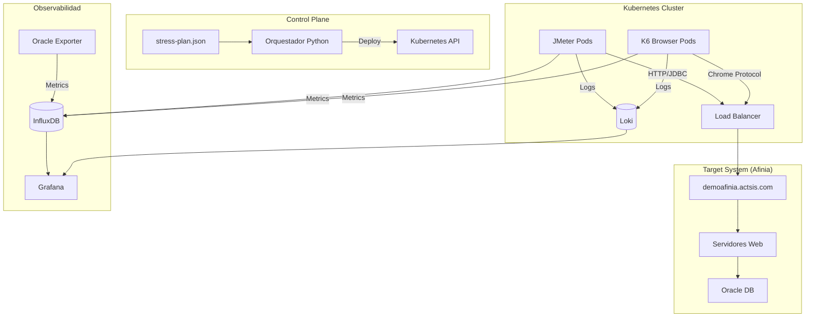

# AFINIA — Día 4: Configuración de Monitoreo
## Infraestructura de Pruebas de Estrés

<!-- _class: first-slide -->

<!--
Objetivos: visibilidad end-to-end, validación de métricas, aprobación del monitoreo.
Alcance: App web, base de datos Oracle 19c, inyectores JMeter/K6, infraestructura.
Alinear métricas con criterios de aceptación del Comité Evaluador.
-->

<!-- TODO: Insertar captura aquí: Agenda oficial resaltada en “Día 4” -->

---

# Topología de la Infraestructura

- **Arquitectura**: Distribuida sobre Kubernetes.
- **Componentes**: Orquestador (Python), Jobs (JMeter/K6), InfluxDB, Grafana.
- **Target**: `demoafinia.actsis.com` (149.130.186.237).

<!--
Aclarar namespaces, políticas DNS y límites de recursos.
Orquestador Central (Python) interpreta el plan de pruebas y despliega Jobs.
-->

---

# Orquestación y Plan de Prueba

- **Archivo**: `stress-plan.json` define fases (inicio, calentamiento, ramp-up).
- **Escalado**: Progresivo de 0 a 40+ usuarios concurrentes.
- **Datos**: Distribución por índice (`CLIENTE_ID`).

<!-- TODO: Insertar captura aquí: snippet de stress-plan.json y stress-orchestrator.py -->

<!--
El script stress-orchestrator.py gestiona las fases.
Persistencia: Inyectores K6 usan volumen compartido o config en memoria para CLIENTE_ID.json.
-->

---

# Generadores de Carga: JMeter (Protocolo)

Pruebas de alto rendimiento a nivel de API y Base de Datos (JDBC).

| Variable | Valor |
| :--- | :--- |
| **Imagen** | `danielrondongarcia/jmeter-stress:latest` |
| **Despliegue** | Kubernetes Job (Indexed) |
| **CPU** | 500m / 1000m (1 Core) |
| **RAM** | 1Gi / 4Gi |
| **DNS** | Custom HostAlias (`demoafinia` -> `149.130.186.237`) |

<!-- TODO: Insertar captura aquí: Pod JMeter en Kubernetes + métricas de throughput -->

<!--
Política DNS: None (Nameservers: 192.168.25.201, 8.8.8.8).
Colección de métricas a InfluxDB; logs -> Promtail.
-->

---

# Generadores de Carga: K6 (Browser)

Simulación de experiencia de usuario real (End-to-End) con Chromium.

| Variable | Valor |
| :--- | :--- |
| **Imagen** | `danielrondongarcia/k6-stress:latest` |
| **CPU** | 7000m (7 Cores dedicados) |
| **RAM** | 10Gi |
| **Navegador** | Chromium (Headless) |
| **Shm Size** | Host IPC / Configurado para evitar crash |

<!-- TODO: Insertar captura aquí: Panel de VUs y tiempos de respuesta de K6 en Grafana -->

<!--
Requieren mayor capacidad de cómputo por renderización.
Lectura de CLIENTE_ID.json por pod para evitar data overlap.
-->

---

# Observabilidad: InfluxDB y Grafana

- **InfluxDB v2**: Org `AFINIA`, Bucket `dev`.
- **Grafana**: Dashboards de VUs, latencia, error rate, recursos.
- **Acceso**: Organización y usuario creados para AFINIA (acceso en vivo).

<!-- TODO: Insertar captura aquí: Dashboard principal y variables en Grafana -->

<!--
Mapear paneles a queries (measurement, tags, fields).
Repositorio de métricas: Almacenamiento de series temporales.
-->

---

# Logs Distribuidos y Base de Datos

- **Logs**: Promtail + Loki para centralizar logs de JMeter, K6 y DB.
- **Base de Datos**: Oracle Database 19c Enterprise Edition.
- **Oracle Exporter**:
  - `v$session`, `v$sysmetric`
  - `wait_class`, bloqueos TX
  - Definido en `custom-metrics.toml`

<!-- TODO: Insertar captura aquí: Loki (filtros por job/pod) y panel de Oracle en Grafana -->

<!--
Retención y etiquetas (job, namespace, pod, nivel).
Monitorización de bloqueos y esperas es crítica.
-->

---

# Arquitectura SaaS: Perímetro y Accesos

**Objetivo**: Mostrar quién entra y por dónde.

- **Oracle Cloud (Bogotá)**: VCN aislada para seguridad.
- **Accesos**:
  1. **Público**: Usuarios externos vía Internet.
  2. **Corporativo (Afinia)**: VPN segura para administradores.
- **Subred Pública**:
  - **WAF**: Filtra ataques.
  - **Load Balancer**: Único punto visible, distribuye tráfico.

<!-- TODO: Insertar captura aquí: Diagrama de perímetro -->

<!--
Políticas WAF; reglas LB y Health Checks.
Aquí no viven los datos, solo los guardianes.
-->

---

# Capa de Aplicación (Alta Disponibilidad)

**Objetivo**: Procesamiento y resiliencia.

- **Subred Privada Web**: Servidores de aplicación.
- **AutoScaling**: Grupo de servidores que crece/decrece según demanda.
- **Fault Domains**: Distribución en 3 zonas físicas distintas.
- **Seguridad**: Nadie entra directo desde internet, solo el Balanceador.

<!-- TODO: Insertar captura aquí: Gráfico de ASG/instances y health -->

<!--
Políticas de scaling y límites.
Si falla un rack físico, los otros dos siguen operando.
-->

---

# Capa de Datos (Backend)

**Objetivo**: Dónde reside la información sensible.

- **Subred Privada de Datos**: Nodos de procesamiento y Base de Datos.
- **Aislamiento**: Zona completamente aislada.
- **Acceso**: Solo los servidores web pueden hablar con la BD.

<!-- TODO: Insertar captura aquí: Diagrama de seguridad/NSG/SG -->

<!--
Endpoints y reglas de conectividad.
Garantiza máxima seguridad para la información del negocio.
-->

---

# Salida y Servicios Auxiliares

**Objetivo**: Actualizaciones y almacenamiento seguro.

- **NAT Gateway**: Salida a internet para actualizaciones (sin entrada).
- **Service Gateway**: Conexión privada a Object Storage.
- **Ecosistema**: Arquitectura completa, segura, escalable y redundante.

<!-- TODO: Insertar captura aquí: Diagrama completo con flujos -->

<!--
Backups/artefactos en Object Storage.
Sin salir nunca a la internet pública.
-->

---

# Validación de Monitoreo y Checklist

- **Visibilidad**: Métricas en Grafana y retención en InfluxDB/Loki.
- **Alertas**: Latencia, Error Rate, CPU/RAM, Waits DB.
- **Aprobación**: Monitoreo como insumo válido para evaluación.

<!-- TODO: Insertar captura aquí: Grafana (latencia p95/p99), Loki, InfluxDB -->

<!--
Criterios de aceptación y evidencias.
Confirmar que el monitoreo es completo y estable.
-->

---

# Evidencias y Próximos Pasos

- **Evidencias**: Capturas de dashboards, consultas, logs.
- **Pendientes**:
  - Umbrales finales.
  - Ventanas de prueba.
  - Acceso VPN si aplica.

<!-- TODO: Insertar captura aquí: Tabla de hallazgos/acciones -->

<!--
Fechas y responsables.
Confirmar ajustes menores según las pruebas.
-->

---

<!-- _class: questions -->

Daniel G. Rondón García
<daniel.rondon@actsis.com>
