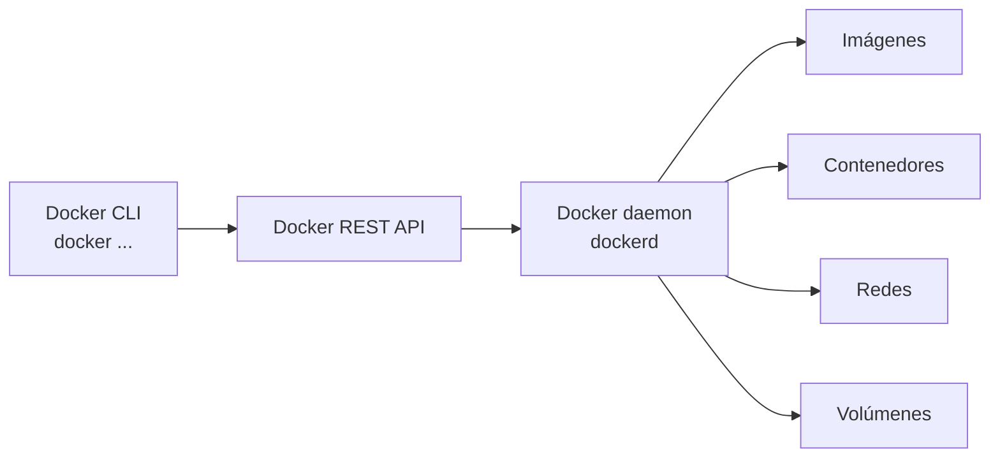
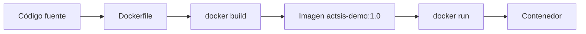

<style lang=css>
/* Local adjustments for this deck. The ACTSIS theme remains the source of truth. */
.docker-blue { color: #2496ED; }
.muted { color: #aaa; }
.small { font-size: 0.72em; }
.command-label { color: #2496ED; font-weight: 800; }
pre code { font-size: 0.92em; }
.highlight-callout {
  background: linear-gradient(135deg, #4ecdc4 0%, #6bcf7f 100%);
  color: #1a1a1a;
  padding: 0.55em 1em;
  border-radius: 8px;
  margin-top: 0.65em;
  font-weight: 700;
  font-size: 0.84em;
}
</style>

# Docker

## De la imagen al taller local

Fundamentos, Docker CLI y un ejemplo práctico

2026

<!-- _class: first-slide -->

<!--
Objetivo de esta primera parte: construir el modelo mental mínimo para trabajar
con Docker y crear un contenedor a partir de una imagen.
-->

<!--
NOTAS DEL ORADOR
- Presenta el alcance: fundamentos, CLI y taller local.
- Anticipa el recorrido: imagen, contenedor, ejecución y Dockerfile.
- Aclara que los comandos se aplicarán paso a paso.
-->
---

# Contenido

<!-- _class: cool-list toc -->

1. [Docker](#3)
    - Máquinas virtuales y contenedores
    - Imágenes, contenedores y Docker Engine
2. [Docker CLI](#7)
    - Descargar una imagen
    - Crear un contenedor
3. [Ejecutar contenedores](#13)
4. [Dockerizar una aplicación](#19)
5. [Taller local](#26)

<!--
NOTAS DEL ORADOR
- Muestra la ruta de la sesión antes de empezar.
- Explica que cada sección responde a una etapa del ciclo de Docker.
- Reserva las preguntas de detalle para los puntos de control.
-->
---

# 01. Docker

<!-- _class: lead -->

<!--
NOTAS DEL ORADOR
- Abre con el problema: el mismo software puede comportarse distinto según el entorno.
- Indica que primero construiremos el modelo mental.
- Da paso a la comparación entre máquinas virtuales y contenedores.
-->
---

<!-- _class: split-columns inverted -->

<div class="left-content">

# Máquinas virtuales

- Cada VM incluye un sistema operativo invitado.
- Un hipervisor asigna CPU, memoria y almacenamiento.
- El aislamiento es fuerte, pero el consumo y el arranque suelen ser mayores.

</div>

<div class="right-content">

# Contenedores

- Empaquetan la aplicación y sus dependencias.
- Comparten el kernel del sistema anfitrión.
- Inician rápido y permiten ejecutar varios servicios en el mismo host.

<div class="highlight-callout">
Un contenedor aísla procesos. No reemplaza una VM en todos los escenarios.
</div>

</div>

<!--
La distinción importante no es "VM mala, contenedor bueno".
Una VM virtualiza una máquina completa. Un contenedor aísla procesos y reutiliza
el kernel del host. Docker simplifica la distribución y ejecución del software,
pero el nivel de aislamiento sigue dependiendo del entorno donde corre.
-->

<!--
NOTAS DEL ORADOR
- Compara el alcance de una VM con el de un contenedor.
- Destaca que los contenedores comparten el kernel del host.
- Aclara que Docker no sustituye a las VM en todos los escenarios.
-->
---

## Imagen, contenedor y Docker Engine

| Concepto | Qué representa |
| :--- | :--- |
| <span class="docker-blue">Imagen</span> | Plantilla inmutable con el sistema de archivos y la configuración necesaria para ejecutar una aplicación |
| <span class="docker-blue">Contenedor</span> | Instancia creada a partir de una imagen, con identidad y una capa de escritura propia |
| <span class="docker-blue">Docker Engine</span> | Motor que recibe solicitudes, administra imágenes y crea contenedores |

<div class="highlight-callout">
La imagen se comparte. El contenedor es una instancia.
</div>

<!--
NOTAS DEL ORADOR
- Define los tres objetos que se usarán durante la práctica.
- Usa la analogía: imagen como plantilla y contenedor como instancia.
- Conecta Docker Engine con las operaciones que veremos en la CLI.
-->
---

## Por qué usar Docker

- **Repetibilidad**: el mismo artefacto define el entorno esperado.
- **Aislamiento**: cada servicio mantiene sus procesos y dependencias separados.
- **Portabilidad**: el contenedor se mueve entre entornos compatibles con Docker Engine.
- **Entrega más simple**: desarrollo, pruebas y operación parten de la misma imagen.
- **Escalado**: una imagen puede originar varias instancias del servicio.

<div class="highlight-callout">
Docker reduce diferencias entre entornos. No elimina la necesidad de configurar redes, datos, secretos y seguridad.
</div>

<!--
NOTAS DEL ORADOR
- Relaciona Docker con repetibilidad y entrega consistente.
- Aclara que Docker no resuelve por sí solo redes, secretos ni seguridad.
- Transita desde el valor de Docker hacia su uso operativo.
-->
---

# 02. Usando Docker CLI

<!-- _class: lead -->

<!--
NOTAS DEL ORADOR
- Anuncia el paso de los conceptos a los comandos.
- Indica que veremos un flujo mínimo antes de ampliar los casos.
- Pide seguir la secuencia, no memorizar todos los comandos.
-->
---

## Docker Engine y Docker CLI



<div class="highlight-callout">
La CLI solicita operaciones. El daemon las ejecuta y mantiene el estado de Docker.
</div>

<!--
En una instalación local, la CLI y el daemon suelen vivir en el mismo equipo.
Docker Desktop agrega la integración necesaria en macOS y Windows.
En todos los casos, el flujo conceptual es el mismo: cliente, API y daemon.
-->

<!--
NOTAS DEL ORADOR
- Recorre el flujo CLI, API y daemon del diagrama.
- Explica que la CLI pide la acción y el daemon mantiene el estado.
- Si haces demo, confirma que Docker Desktop o Docker Engine esté activo.
-->
---

## El flujo mínimo con Docker CLI

| Etapa | Comando | Resultado |
| :--- | :--- | :--- |
| 1 | `docker pull <imagen>` | Descarga la imagen desde un registro |
| 2 | `docker images` | Muestra las imágenes locales |
| 3 | `docker create <imagen>` | Crea un contenedor detenido |
| 4 | `docker ps -a` | Muestra contenedores, incluidos los detenidos |

<div class="highlight-callout">
En esta parte llegaremos hasta la creación. Iniciar y operar el contenedor es el siguiente paso.
</div>

<!--
NOTAS DEL ORADOR
- Explica el orden: descargar, listar, crear y comprobar.
- Resalta que crear no equivale a iniciar.
- Indica que la siguiente demostración termina en un contenedor detenido.
-->
---

## Descargar una imagen

Usaremos `hello-world`, una imagen pequeña para validar la instalación.

```bash
$ docker pull hello-world
Using default tag: latest
latest: Pulling from library/hello-world
Status: Downloaded newer image for hello-world:latest
docker.io/library/hello-world:latest
```

<div class="highlight-callout">
`pull` trae la imagen al equipo. Todavía no crea un contenedor.
</div>

<!--
La salida exacta puede cambiar según la versión de Docker y si la imagen ya
existe localmente. Lo importante es separar la descarga de la creación.
-->

<!--
NOTAS DEL ORADOR
- Presenta hello-world como una imagen pequeña de validación.
- Si haces demo, ejecuta pull y muestra que la imagen queda local.
- Aclara que la salida puede variar si la imagen ya estaba descargada.
-->
---

## Crear un contenedor

`docker create` prepara una instancia a partir de la imagen, pero no inicia su proceso.

```bash
$ docker create --name hello-world hello-world
8f6b2b8a7e4d...

$ docker ps -a
CONTAINER ID   IMAGE        COMMAND   STATUS                  NAMES
8f6b2b8a7e4d   hello-world  "/hello"   Created                 hello-world
```

<div class="highlight-callout">
Una respuesta con el identificador del contenedor confirma la creación. El estado esperado es <strong>Created</strong>.
</div>

<!--
El identificador real cambia en cada ejecución. Se muestra truncado para
explicar la forma de la salida sin presentar un valor fijo como evidencia.
-->

<!--
NOTAS DEL ORADOR
- Ejecuta o describe docker create con un nombre reconocible.
- Muestra el identificador y el estado Created en docker ps -a.
- Recalca que el proceso aún no se ha iniciado.
-->
---

## Punto de control

### Ya tenemos dos objetos locales

| Objeto | Qué representa | Estado al cerrar esta parte |
| :--- | :--- | :--- |
| Imagen `hello-world:latest` | Plantilla descargada | Disponible localmente |
| Contenedor `hello-world` | Instancia configurada | Creado y detenido |

<div class="highlight-callout">
Imagen = plantilla · Contenedor = instancia · `docker create` = preparar sin iniciar
</div>

<!--
NOTAS DEL ORADOR
- Pregunta al grupo qué objeto es la imagen y cuál es el contenedor.
- Confirma que ambos existen localmente y tienen estados distintos.
- Usa este punto para enlazar con el inicio del contenedor.
-->
---

# 03. Ejecutar un contenedor

<!-- _class: lead -->

<!--
NOTAS DEL ORADOR
- Presenta la nueva etapa: pasar de un contenedor detenido a uno en ejecución.
- Recuerda que partimos de la instancia creada antes.
- Anticipa la diferencia entre start y run.
-->
---

## Iniciar un contenedor existente

`docker start` inicia un contenedor que ya fue creado. La opción `--attach` conecta la salida del contenedor con nuestra terminal.

```bash
$ docker start --attach hello-world
Hello from Docker!
This message shows that your installation appears to be working correctly.
```

<div class="highlight-callout">
Un contenedor basado en `hello-world` termina después de imprimir el mensaje.
</div>

<!--
`docker start` trabaja sobre una instancia existente. El nombre o el ID son
intercambiables. La salida real puede variar ligeramente según la versión.
-->

<!--
NOTAS DEL ORADOR
- Muestra que docker start reutiliza una instancia existente.
- Si haces demo, usa --attach para ver la salida de hello-world.
- Aclara que hello-world termina después de escribir su mensaje.
-->
---

## El atajo `docker run`

`docker run` combina la creación y el inicio de un contenedor nuevo.

```bash
$ docker run --name hello-world-run hello-world
Hello from Docker!
This message shows that your installation appears to be working correctly.
```

| Comando | Acción principal |
| :--- | :--- |
| `docker create` | Crea la instancia sin iniciarla |
| `docker start` | Inicia una instancia existente |
| `docker run` | Crea y luego inicia una instancia nueva |

<!--
NOTAS DEL ORADOR
- Contrasta docker run con la combinación create más start.
- Si haces demo, usa otro nombre para no confundir los contenedores.
- Señala que run crea una instancia nueva antes de iniciarla.
-->
---

<!-- _class: split-columns -->

<div class="left-content">

## Imágenes locales

```bash
$ docker image ls
REPOSITORY   TAG      IMAGE ID       SIZE
hello-world  latest   ...            13.3kB
```

</div>

<div class="right-content">

## Todos los contenedores

```bash
$ docker container ls -a
CONTAINER ID   IMAGE        STATUS       NAMES
...            hello-world  Exited (0)   hello-world-run
```

</div>

<!--
`docker image ls` muestra imágenes. `docker container ls -a` muestra instancias
creadas, incluso las que ya terminaron. Se muestran IDs truncados porque los
valores reales cambian en cada equipo.
-->

<!--
NOTAS DEL ORADOR
- Diferencia las imágenes descargadas de las instancias creadas.
- Muestra que docker container ls -a incluye contenedores terminados.
- Aclara que los IDs reales cambian en cada equipo.
-->
---

## Ejecución interactiva

Para abrir una terminal dentro de un contenedor, usamos `--interactive` y `--tty`.

```bash
$ docker run --rm -it --name ubuntu-shell ubuntu bash
root@a1b2c3d4:/# cat /etc/os-release
root@a1b2c3d4:/# exit
```

- `-i` mantiene abierta la entrada estándar.
- `-t` asigna una terminal.
- `--rm` elimina el contenedor al salir.

<div class="highlight-callout">
`--rm` es útil en talleres para no acumular contenedores temporales.
</div>

<!--
NOTAS DEL ORADOR
- Explica que -i conserva la entrada y -t aporta una terminal.
- Si haces demo, entra al contenedor Ubuntu y ejecuta un comando breve.
- Recuerda que --rm limpia el contenedor al salir.
-->
---

## Ver lo que está ejecutándose

`docker ps` muestra únicamente los contenedores activos.

```bash
$ docker ps
CONTAINER ID   IMAGE   COMMAND   STATUS        PORTS     NAMES
...            ubuntu  "bash"    Up 12 seconds           ubuntu-shell
```

<div class="highlight-callout">
Para incluir contenedores detenidos, usa `docker ps -a`.
</div>

<!--
NOTAS DEL ORADOR
- Muestra docker ps mientras haya un contenedor activo.
- Contrasta su resultado con docker ps -a.
- Indica que observar estado es parte de operar un contenedor.
-->
---

# 04. Dockerizar una aplicación

<!-- _class: lead -->

<!--
NOTAS DEL ORADOR
- Presenta la etapa de dockerizar: transformar código en un artefacto repetible.
- Anticipa el flujo, el Dockerfile, build y ejecución.
- Conecta esta sección con el taller local del cierre.
-->
---

## Del código a una imagen



<div class="highlight-callout">
El Dockerfile convierte decisiones de instalación y ejecución en un artefacto repetible.
</div>

<!--
NOTAS DEL ORADOR
- Recorre la cadena código, Dockerfile, build, imagen y run.
- Explica que el Dockerfile conserva decisiones de instalación y arranque.
- Da paso al ejemplo local que se usará en el taller.
-->
---

## Ejemplo local: un servidor HTTP en Node.js

```js
const http = require("node:http");

const port = process.env.PORT || 3000;

const server = http.createServer((request, response) => {
  response.writeHead(200, { "content-type": "text/plain; charset=utf-8" });
  response.end("Hola desde un contenedor Docker\\n");
});

server.listen(port, "0.0.0.0", () => {
  console.log("Servidor escuchando en el puerto " + port);
});
```

<div class="highlight-callout">
Escucha en `0.0.0.0` para aceptar conexiones externas.
</div>

<!--
NOTAS DEL ORADOR
- Describe el servidor como una aplicación mínima para la práctica.
- Explica que escucha en 0.0.0.0 para aceptar conexiones externas.
- Relaciona el puerto 3000 con el Dockerfile y el comando de ejecución.
-->
---

## El Dockerfile del ejemplo

```dockerfile
FROM node:20-alpine

WORKDIR /app
COPY server.js .

EXPOSE 3000
CMD ["node", "server.js"]
```

<p class="small"><code>FROM</code> base · <code>WORKDIR</code> carpeta · <code>COPY</code> archivos<br><code>EXPOSE</code> puerto · <code>CMD</code> arranque</p>

<!--
NOTAS DEL ORADOR
- Lee el Dockerfile de arriba hacia abajo.
- Explica la función de FROM, WORKDIR, COPY, EXPOSE y CMD.
- Aclara que EXPOSE documenta el puerto, pero no lo publica.
-->
---

## Construir la imagen

Ejecuta el comando desde la carpeta que contiene `Dockerfile` y `server.js`.

```bash
$ docker build -t actsis-demo:1.0 .

$ docker image ls actsis-demo
REPOSITORY   TAG   IMAGE ID       SIZE
actsis-demo  1.0   ...            ...
```

- `-t` asigna el nombre y la etiqueta.
- `.` define el contexto de construcción.

<div class="highlight-callout">
Un `.dockerignore` evita enviar basura al daemon.
</div>

<!--
NOTAS DEL ORADOR
- Indica que build debe ejecutarse desde la carpeta del proyecto.
- Explica que -t asigna nombre y versión a la imagen.
- Advierte que el punto define el contexto enviado al daemon.
-->
---

## Ejecutar la aplicación

```bash
$ docker run --rm --name actsis-demo \
    -p 3000:3000 actsis-demo:1.0
```

Abre <span class="docker-blue">http://localhost:3000</span> en el navegador.

| Parte | Significado |
| :--- | :--- |
| `-p 3000:3000` | Publica el puerto |
| `--rm` | Borra al terminar |
| `actsis-demo:1.0` | Imagen a ejecutar |

<div class="highlight-callout">
`EXPOSE` documenta el puerto. `-p` lo publica.
</div>

<!--
NOTAS DEL ORADOR
- Si haces demo, ejecuta el contenedor y abre localhost:3000.
- Distingue EXPOSE como documentación y -p como publicación del puerto.
- Advierte que un puerto ocupado requiere cambiar el puerto del host.
-->
---

# 05. Taller local

<!-- _class: lead -->

<!--
NOTAS DEL ORADOR
- Introduce el taller como una práctica de cambio, build y observación.
- Indica el resultado esperado: una imagen versionada que responde por HTTP.
- Pide crear los archivos antes de ejecutar comandos.
-->
---

## Archivos del ejercicio

```text
docker-demo/
├── server.js
├── Dockerfile
└── .dockerignore
```

`.dockerignore`:

```text
.git
node_modules
.env
```

<div class="highlight-callout">
Cambia el código, reconstruye la imagen y vuelve a probar.
</div>

<!--
NOTAS DEL ORADOR
- Recorre los tres archivos que componen el ejercicio.
- Explica que .dockerignore reduce el contexto de construcción.
- Indica que cada cambio de código requiere reconstruir la imagen.
-->
---

## Reto 1: cambiar y versionar

1. Cambia el mensaje de `server.js`.
2. Construye una nueva etiqueta.
3. Ejecuta la nueva imagen en el puerto `3001`.

```bash
docker build -t actsis-demo:1.1 .
docker run --rm --name actsis-demo-v11 -p 3001:3000 actsis-demo:1.1
```

Comprueba el resultado en <span class="docker-blue">http://localhost:3001</span>.

<!--
NOTAS DEL ORADOR
- Indica el orden: cambiar mensaje, construir la versión 1.1 y ejecutar.
- Resalta que el puerto 3001 evita competir con la versión anterior.
- Pide comprobar el resultado en el navegador antes de continuar.
-->
---

## Reto 2: observar y limpiar

Mientras el servidor está activo, abre otra terminal:

```bash
docker ps
docker logs -f actsis-demo-v11
docker stop actsis-demo-v11
```

Después, revisa las imágenes y contenedores que quedaron en tu equipo.

<div class="highlight-callout">
El taller termina cuando puedes explicar qué creó cada comando y qué recurso quedó almacenado.
</div>

<!--
NOTAS DEL ORADOR
- Pide abrir una segunda terminal mientras el servidor sigue activo.
- Explica que ps observa, logs sigue la salida y stop detiene el proceso.
- Cierra revisando qué contenedores e imágenes quedaron almacenados.
-->
---

<!-- _class: questions -->

# ¿Preguntas?

## ¡Empecemos!
<!--
NOTAS DEL ORADOR
- Abre el espacio para preguntas sobre imagen, contenedor, build o run.
- Pide a una persona explicar qué hace uno de los comandos del taller.
- Sugiere repetir el flujo con una aplicación propia como siguiente paso.
-->
