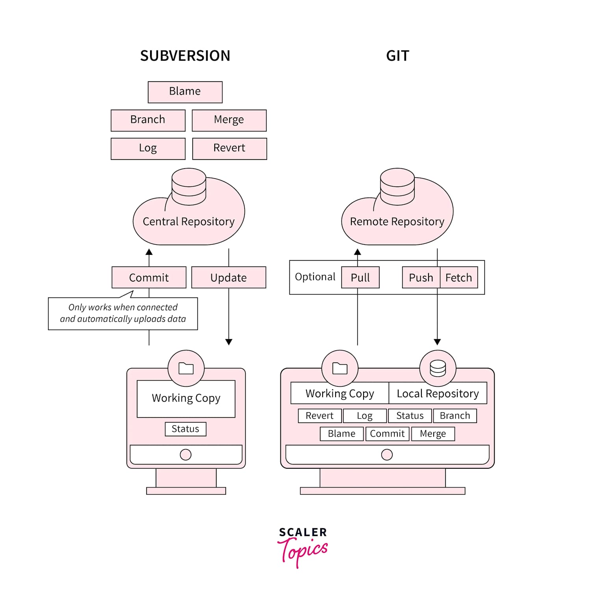
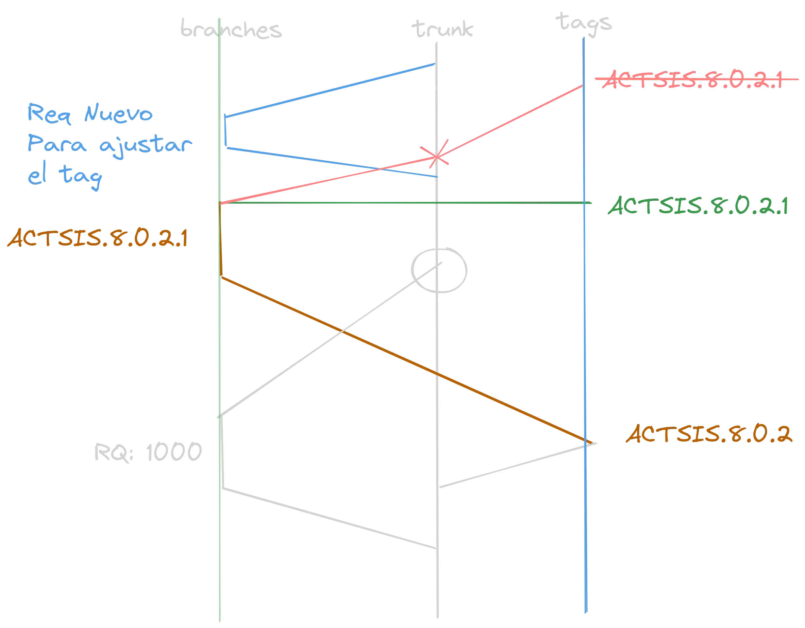
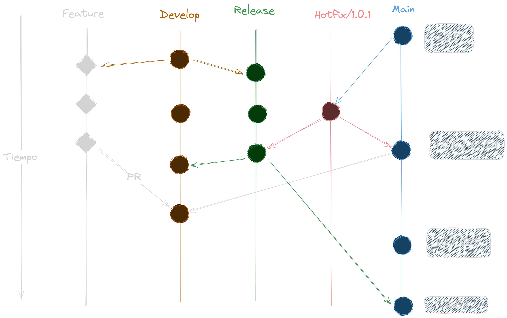
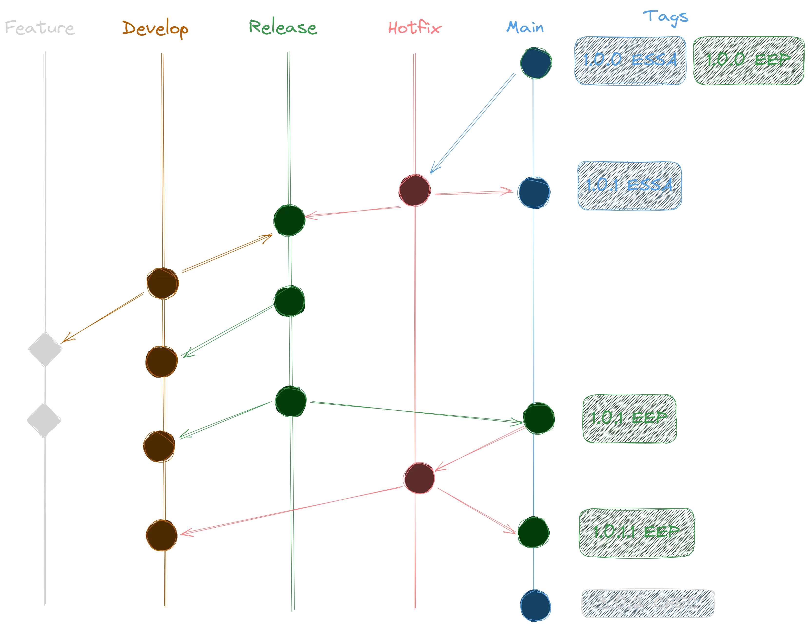
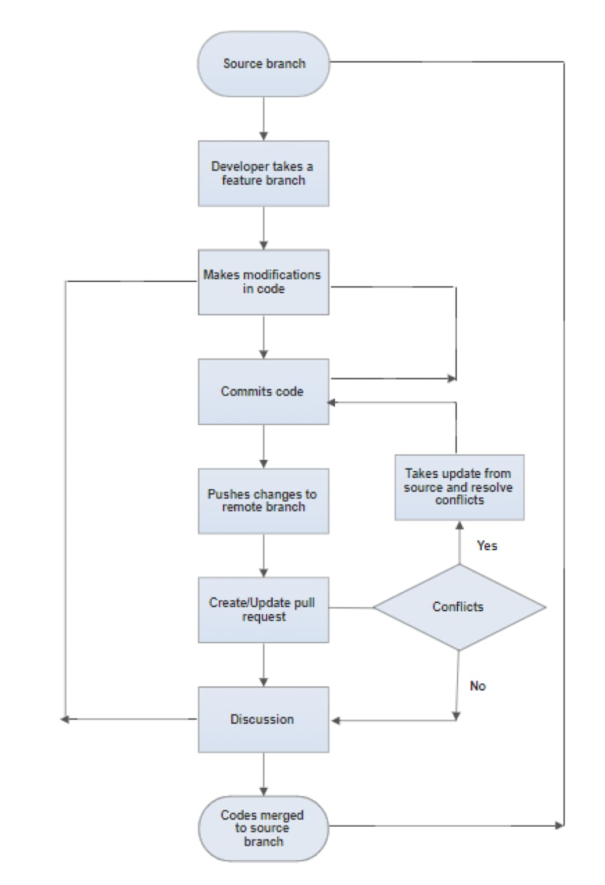

<style lang=css>
/*
Rosé Pine theme create by RAINBOWFLESH
> www.rosepinetheme.com

palette in :root
*/

@import "default";

:root {
  --base: #232136;
    --surface: #2a273f;
    --overlay: #393552;
    --muted: #6e6a86;
    --subtle: #908caa;
    --text: #e0def4;
    --love: #eb6f92;
    --gold: #f6c177;
    --rose: #ea9a97;
    --pine: #3e8fb0;
    --foam: #9ccfd8;
    --iris: #c4a7e7;
    --highlight-low: #2a283e;
    --highlight-muted: #44415a;
    --highlight-high: #56526e;

  font-family: Pier Sans, ui-sans-serif, system-ui, -apple-system,
    BlinkMacSystemFont, Segoe UI, Roboto, Helvetica Neue, Arial, Noto Sans,
    sans-serif, "Apple Color Emoji", "Segoe UI Emoji", Segoe UI Symbol,
    "Noto Color Emoji";
  font-weight: initial;

  background-color: var(--base);
}
/*Common style*/
h1 {
  color: var(--rose);
  padding-bottom: 2mm;
  margin-bottom: 12mm;
}
h2 {
  color: var(--rose);
}
h3 {
  color: var(--rose);
}
h4 {
  color: var(--rose);
}
h5 {
  color: var(--rose);
}
h6 {
  color: var(--rose);
}
a {
  color: var(--iris);
}
p {
  font-size: 20pt;
  font-weight: 600;
  color: var(--text);
}
code {
  color: var(--text);
  background-color: var(--highlight-muted);
}
text {
  color: var(--text);
}
ul {
  color: var(--subtle);
}
li {
  color: var(--subtle);
}
img {
  background-color: var(--highlight-low);
}
strong {
  color: var(--muted);
  font-weight: inherit;
  font-weight: 800;
}
mjx-container {
  color: var(--text);
}
marp-pre {
  background-color: var(--overlay);
  border-color: var(--highlight-high);
}

/*Code blok*/
.hljs-comment {
  color: var(--muted);
}
.hljs-attr {
  color: var(--foam);
}
.hljs-punctuation {
  color: var(--subtle);
}
.hljs-string {
  color: var(--gold);
}
.hljs-title {
  color: var(--foam);
}
.hljs-keyword {
  color: var(--pine);
}
.hljs-variable {
  color: var(--text);
}
.hljs-literal {
  color: var(--rose);
}
.hljs-type {
  color: var(--love);
}
.hljs-number {
  color: var(--gold);
}
.hljs-built_in {
  color: var(--love);
}
.hljs-params {
  color: var(--iris);
}
.hljs-symbol {
  color: var(--foam);
}
.hljs-meta {
  color: var(--subtle);
}

</style>

# Fundamentos de GIT

<!-- _class: first-slide -->

2025

---

# Hoy hablamos de...

<!-- _class: cool-list toc -->

1. [Introducción y Cambio de Paradigma](#3)
1. [Comandos Básicos de Git](#14)
1. [Herramientas de Desarrollo](#32)
1. [Sistemas que utilizan Git](#48)
1. [Git Flow y Estrategias de Branching](#62)
1. [Pull Requests vs SVN Merge](#69)
1. [Conventional Commits](#77)
1. [Versionamiento en Múltiples Empresas](#78)

---

# Introducción y Cambio de Paradigma

<!-- _class: lead -->

---

## ¿Qué es Git?

<!-- Mencionar que Linus Torvalds también creó Linux -->

Git es un sistema de control de versiones distribuido creado por Linus Torvalds en 2005. A diferencia de SVN, cada copia local es un repositorio completo con historial completo.

<!-- Transición: explicar las ventajas del modelo distribuido -->

---

<!-- _class: split-columns -->

<div class="left-content">



</div>

<div class="right-content">

<!-- La transición de SVN a Git representa un cambio fundamental de paradigma en el control de versiones. SVN utiliza un modelo centralizado donde existe un único servidor central que almacena todo el historial del proyecto, mientras que los desarrolladores trabajan con copias locales limitadas. En contraste, Git implementa un modelo distribuido donde cada clon del repositorio contiene el historial completo del proyecto. -->

## SVN vs Git: Arquitectura

<!-- - Trabajo offline: Git permite mientras que SVN requiere conectividad para la mayoría de operaciones
- Rendimiento: Las operaciones locales en Git son significativamente más rápidas al no requerir comunicación con el servidor
- Integridad: Git utiliza checksums SHA-1/SHA-256 para garantizar la integridad de todos los datos -->

- SVN: Modelo centralizado - Un servidor central, copias de trabajo locales
- Git: Modelo distribuido - Cada clone es un repositorio completo

</div>

---

<!-- Una diferencia crucial es el sistema de identificación de commits. SVN utiliza números secuenciales incrementales (1, 2, 3...), mientras que Git emplea hashes criptográficos de 40 caracteres hexadecimales. Esta diferencia no es arbitraria:
Los hashes en Git proporcionan ventajas fundamentales:
- Unicidad global: Cada commit tiene un identificador único en cualquier repositorio
- Integridad de datos: Cualquier cambio en el contenido genera un hash completamente diferente
- Compatibilidad distribuida: Los hashes funcionan sin coordinación central -->

## ¿Por qué hashes?

Git usa SHA-1/SHA-256 para generar hashes de los commits, en lugar de números secuenciales porque:

- Funcionan en sistemas distribuidos
- Garantizan integridad de datos
- Permiten identificación única global

---

# Comandos Básicos de Git

<!-- _class: lead -->

---

## Equivalencias SVN → Git

| SVN          | GIT        | Descripción                |
| ------------ | ---------- | -------------------------- |
| svn checkout | git clone  | Clonar repositorio         |
| svn commit   | git commit | Confirmar cambios          |
| svn update   | git pull   | Actualizar desde remoto    |
| svn status   | git status | Ver estado de archivos     |
| svn add      | git add    | Añadir archivos al control |
| svn merge    | git merge  | Fusionar cambios           |

---

<!-- Concepto de Staging Area:
Una diferencia fundamental es el staging area de Git, un concepto inexistente en SVN. Esta área intermedia permite:
- Commits granulares: Seleccionar exactamente qué cambios incluir
- Revisión previa: Verificar cambios antes del commit
- Flexibilidad: Modificar la selección de archivos a commitear -->

## Workflow Básico Git

```bash
# Clonar repositorio
git clone <url>
# Crear nueva rama
git branch <nombre-rama>
# Cambiar a la nueva rama
git checkout <nombre-rama>
# Realizar cambios y confirmar
git add .
git commit -m "Mensaje de commit"
# Fusionar con la rama principal
git merge main
# Subir cambios al repositorio remoto
git push origin <nombre-rama>
```

---

# Herramientas de Desarrollo

<!-- _class: lead -->

---

<!-- La línea de comandos de Git ofrece acceso completo a todas las funcionalidades: -->

## Git CLI

### <span style="color: #4ade80">Ventajas</span>

- Acceso completo a todas las funciones
- Rápido y eficiente
- Ideal para automatización

### <span style="color: #f87171">Desventajas</span>

- Curva de aprendizaje pronunciada
- No visual

---

<!-- Herramienta oficial de GitHub para interfaces gráficas: -->

## GitHub Desktop

### <span style="color: #4ade80">Ventajas</span>

- nterfaz simple e intuitiva
- Integración perfecta con GitHub
- Gratuito

### <span style="color: #f87171">Desventajas</span>

- Funcionalidades limitadas
- Principalmente para GitHub

---

<!-- Extensión de Windows Explorer basada en TortoiseSVN: -->

## TortoiseGit

### <span style="color: #4ade80">Ventajas</span>

- Integración con Windows Explorer
- Familiar para usuarios de TortoiseSVN
- Gratuito y open source

### <span style="color: #f87171">Desventajas</span>

- Solo disponible para Windows
- Interfaz menos moderna
- No es retrocompatible con otras herramientas de Git
<!-- Otras Herramientas Destacadas:
- SourceTree: GUI potente de Atlassian con soporte para Git Flow integrado
- GitKraken: Cliente visual premium con excelente representación gráfica
- Tower: Herramienta premium para Mac/Windows con características avanzadas
- Visual Studio Code: Editor con excelente integración Git nativa -->

---

# Sistemas que utilizan Git

<!-- _class: lead -->

---

<!-- _class: split-columns inverted -->

<div class="left-content">

# GitHub

Hosting de código y colaboración

## Fortalezas

- Comunidad open source
- Simplicidad
- GitHub Actions

<div class="highlight-callout">
Mejor para: Proyectos open source, equipos pequeños
</div>

</div>

<div class="right-content">

# Azure DevOps

Suite completa de DevOps

## Fortalezas

- Integración Microsoft
- Project management
- CI/CD robusto

<div class="highlight-callout">
Mejor para: Empresas, ecosistema Microsoft
</div>

</div>

---

# Git Flow y Estrategias de Branching

<!-- _class: lead -->

---

## ¿Qué es Git Flow?
Git Flow es una estrategia de branching creada por Vincent Driessen que define roles específicos para diferentes tipos de branches y reglas sobre cómo interactúan.

---

<!-- Git Flow: Modelo de Branching Estructurado
- Git Flow, creado por Vincent Driessen en 2010, proporciona una estrategia de branching robusta para equipos grandes:
- Branches Principales:
- main/master: Código listo para producción
- develop: Branch de integración para desarrollo activo

Branches de Soporte:
- feature/: Para desarrollo de nuevas funcionalidades
- release/: Para preparación y estabilización de releases
- hotfix/: Para correcciones urgentes en producción

Flujo de Trabajo Git Flow:
- Las features se desarrollan desde develop
- Cuando están listas, se integran de vuelta a develop
- Para releases, se crea branch release/ desde develop
- Tras testing, se merge a main y develop
- Hotfixes se crean desde main y se mergen a ambos branches

Ventajas para Equipos Empresariales:
- Separación clara de responsabilidades
- Procesos de release predecibles
- Soporte para múltiples versiones en producción
- Integración natural con procesos de QA -->
## Branches Principales

- `main/master`: Código listo para producción
- `develop`: Branch de integración para desarrollo

### Branches de soporte:

- `feature/*`: Nuevas funcionalidades
- `release/*`: Preparación de releases
- `hotfix/*`: Correcciones urgentes
---

## Ejemplo SVN



---

<!-- Caso de un hotfix con respecto al tiempo -->
## Ejemplo GIT - Caso 1



---

<!-- (Caso raro) Problema cuando se necesita hacer un hotfix
especificamente a una versión que solo la tiene
una sola empresa, ya existen versiones superiores
y ese ajuste tambien lo necesita las futuras versiones -->
## Ejemplo GIT - Caso 2



---

# Pull Requests vs SVN Merge

<!-- _class: lead -->

---

## SVN: Merge Tradicional

- Merge directo al trunk
- Sin proceso de revisión formal
- Conflictos se resuelven durante el merge
- Menos colaborativo

---

<!-- _class: split-columns -->

<div class="left-content">



</div>

<div class="right-content">

<!-- Evolución del Proceso de Integración
La transición de SVN a Git representa una evolución significativa en cómo se integran los cambios de código:

Proceso Tradicional SVN:
- Merge directo al trunk sin revisión formal
- Resolución de conflictos durante el merge
- Proceso menos colaborativo
- Limitadas oportunidades de feedback

Pull Requests en Git:
- Propuesta de cambios: Los desarrolladores proponen integraciones
- Code review obligatorio: Revisión por pares antes del merge
- Discusión contextual: Comentarios específicos en líneas de código
- Pruebas automatizadas: Integración con CI/CD antes del merge
- Aprobaciones formales: Requerimiento de aprobaciones antes de la integración

Beneficios del Modelo Pull Request:
- Mayor calidad de código través de revisiones
- Conocimiento compartido del codebase
- Documentación implícita de decisiones técnicas
- Detección temprana de problemas
- Proceso más estructurado y auditable -->

## En GIT:
- Propuesta de cambios
- Code review obligatorio
- Discusión y feedback
- Pruebas automáticas
- Merge tras aprobación

</div>

---

# Conventional Commits

<!-- _class: lead -->

---

## ¿Qué son los Conventional Commits?
Especificación ligera sobre mensajes de commit que proporciona reglas para crear historial de commits explícito y facilita herramientas automatizadas.

---

## Estructura

```bash
tipo(ámbito):requerimiento descripción

[cuerpo]

[footer]

Ejemplos:
feat:98311 agregar función de login
fix(api):98311 resolver error en endpoint usuarios
feat!:98311 cambio que rompe compatibilidad
```

---

## Tipos de Commits

<style>
table {
  font-size: 0.9em;
  width: 100%;
  table-layout: fixed;
}
th:first-child, td:first-child {
  width: 20%;
}
th:last-child, td:last-child {
  width: 80%;
}
</style>

| Tipo | Descripción |
|------|-------------|
| **feat** | Nueva funcionalidad |
| **fix** | Corrección de errores |
| **chore** | Tareas rutinarias |
| **test** | Tests |
| **docs** | Documentación |
| **build** | Refactorización |

---

## Automatización
Los Conventional Commits permiten:

- Generación automática de CHANGELOG
- Semantic versioning automático
- Triggers para CI/CD
- Mejor documentación del proyecto

---

<!-- _class: questions -->

Daniel G. Rondón García - <daniel.rondon@actsis.com>
